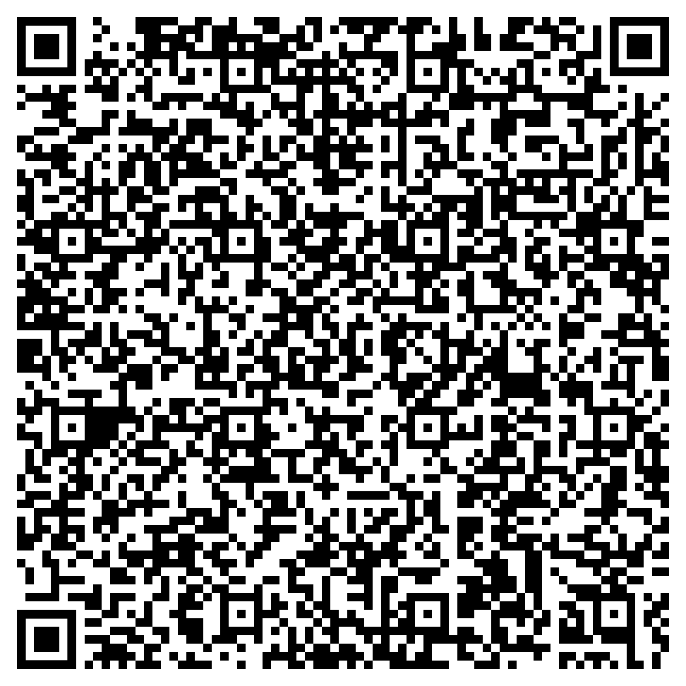

# BlindHelper App

To read in English: [click here](README_ENGLISH.md).

Aplicação para dispositivos móveis de leitura de QR Codes contendo objetos JSON para auxiliar pessoas
com deficiência visual (PDV) a identificar objetos e suas propriedades.

O conteúdo é lido para a PDV de forma estruturada (propriedade e valor), e ela pode navegar entre 
as propriedades usando o _touch_ do seu aparelho.

A aplicação está configurada para ler textos em português brasileiro (_pt_BR_).

# Aplicações

Muitos produtos e objetos não contém qualquer identificação tátil, além de que nem toda PDV conhece 
o alfabeto _braille_, causando a dependência do auxílio de outra pessoa sem deficiência visual. 

O uso de marcadores QR Code contendo a informação estruturada e detalhada do que se trata aquele 
objeto permitiria a independência da PDV em identificar produtos e objetos e seus detalhes.

Veja um exemplo na seção [Exemplo](#exemplo).

# Formato válido

## QR Code

O formato válido do QR Code deve ser texto, cujo conteúdo deve ser um objeto JSON, composto da combinação
de chave-valor, cujos valores devem conter apenas _strings_ ou números. No caso dos números decimais,
a casa decimal deve ser delimitada por ponto. Exemplo:

```json
{
	"Texto": "Valor em texto",
	"Número inteiro": 2,
	"Número decimal": 5.5
}
```


## Datas

As datas devem ser apresentadas em texto, em um dos seguintes formatos abaixo:

```json
{
	"dd de mês de aaaa": "01 de janeiro de 2021",
	"dd/mm/aaaa": "01/01/2021",
	"dd-mm-aaaa": "01-01-2021",
	"aaaa-mm-dd": "2021-01-01",
	"aaaa/mm/dd": "2021/01/01" 
}
```

# <a id='exemplo'>Exemplo

Veja um exemplo [neste vídeo](exemplos/exemplo_aplicacao.mp4) (em português). 

As informações contidas no vídeo são as seguintes:

```json
{"Produto":"Milho Verde em Conserva Pronto para Servir","Marca":"Quero","Peso Líquido":"280g","Informação Nutricional":"Porção de 130g. Valor energético: 179kcal. Carboidratos: 37g. Proteínas: 8,6g. Gorduras totais: 0,8g. Gorduras saturadas: 0g. Gorduras trans: 0g. Fibra alimentar: 5,1g. Sódio: 447mg.","Alérgicos":"Não contém glúten. Pode conter soja.","Validade":"Novembro de 2022"}
```


