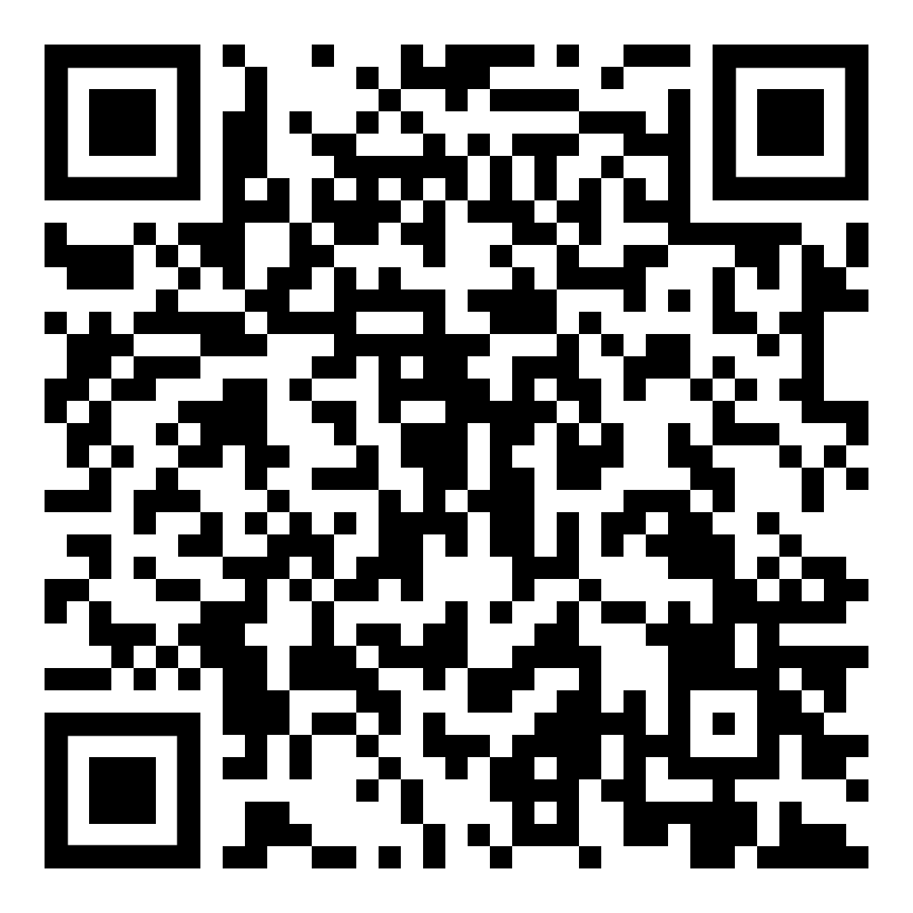
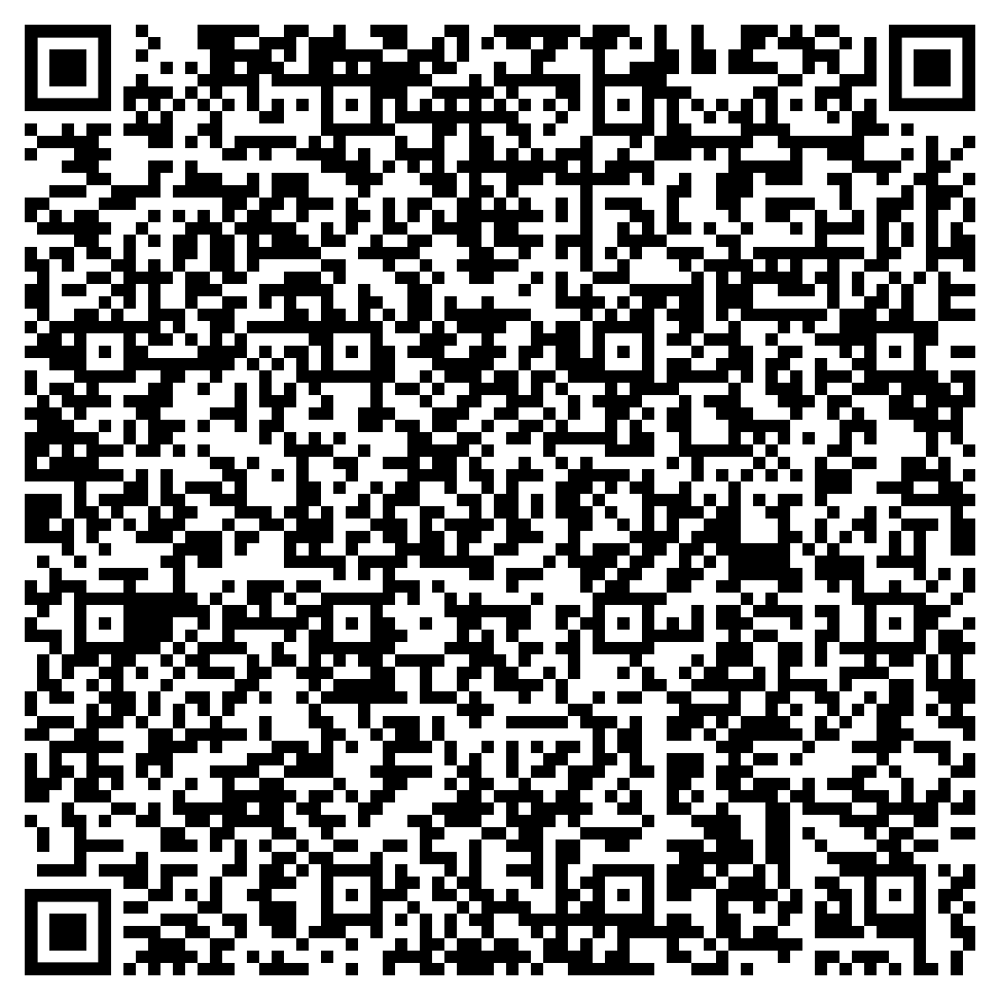

# BlindHelper App  
  
Para ler em português: [clique aqui](README.md).  
  
Application for mobile devices to read QR Codes containing JSON objects to help visually impaired
people (VIP) to identify objects and their properties.
  
The content is read to the VIP in a structured way (property and value), and it can navigate between
properties using the touch of your device.
  
The application is configured to read texts in Brazilian Portuguese (_pt_BR_).
  
# Applications  

Many products and objects do not contain any tactile identification. In addition, not every VIP knows
the Braille alphabet, which makes them dependent on the help of another person without visual impairment.
  
The use of QR Code markers containing structured and detailed information about the object allows
the POS to be independent in identifying products and objects and their details.
  
See an example in the [example section](#exemplo).
  
# Valid Format

## QR Code

The valid QR Code format must be text, whose content must be a JSON object, composed of the key-value
combination, whose values must contain only strings or numbers. In the case of decimal numbers,
the decimal place must be delimited by a point. Example:

```json
{
	"Text": "Text value",
	"Integer": 2,
	"Decimal": 5.5
}
```



## Dates

The dates must be presented in text, in one of the following formats below:

```json
{
	"dd de month de yyyy": "01 de janeiro de 2021",
	"dd/mm/yyyy": "01/01/2021",
	"dd-mm-yyyy": "01-01-2021",
	"yyyy-mm-dd": "2021-01-01",
	"yyyy/mm/dd": "2021/01/01" 
}
```

# <a id='exemplo'>Example

See an example [in this video](exemplos/exemplo_aplicacao.mp4) (in Portuguese).

The information contained in the video is as follows:

```json
{"Produto":"Milho Verde em Conserva Pronto para Servir","Marca":"Quero","Peso Líquido":"280g","Informação Nutricional":"Porção de 130g. Valor energético: 179kcal. Carboidratos: 37g. Proteínas: 8,6g. Gorduras totais: 0,8g. Gorduras saturadas: 0g. Gorduras trans: 0g. Fibra alimentar: 5,1g. Sódio: 447mg.","Alérgicos":"Não contém glúten. Pode conter soja.","Validade":"Novembro de 2022"}
```


